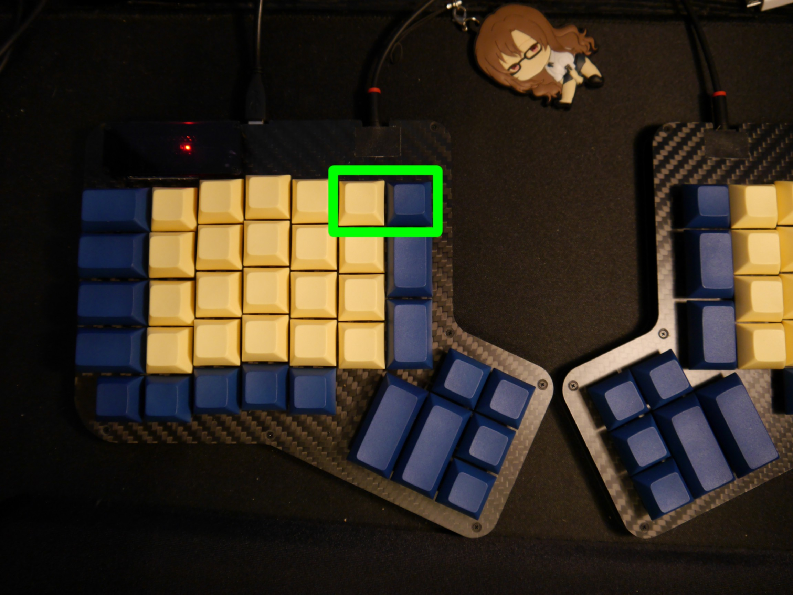
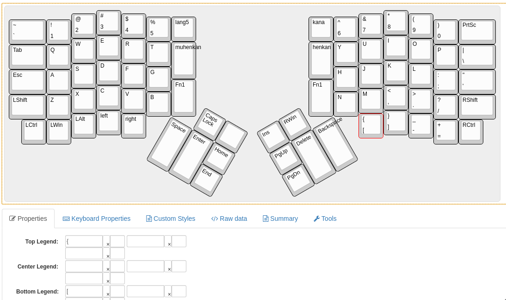
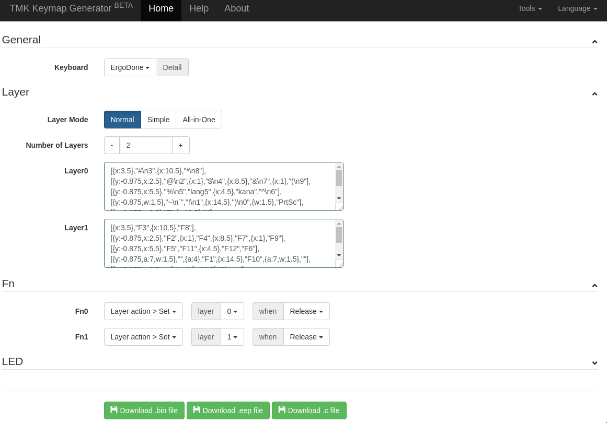
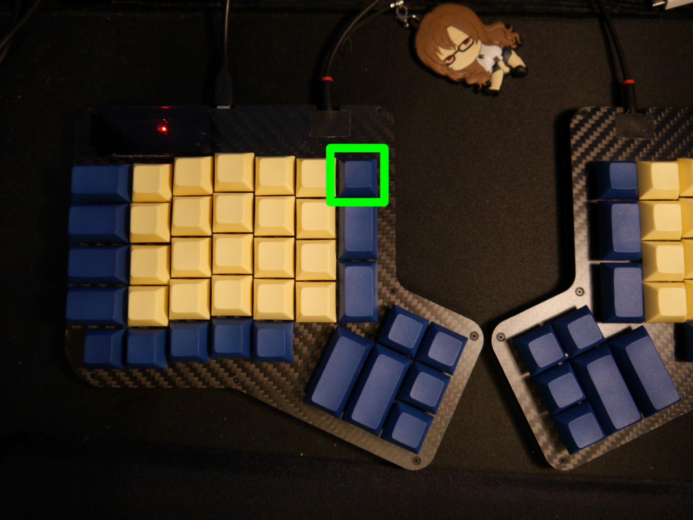

# What's This?
A short explanation of my process of getting an Ergodone keyboard working and configuring it. 
Aimed mainly at Linux, might be different/easier on other OSs. Or maybe not, I don't really know.

# Initial Setup
After you've first assembled your Ergodone, you might or might not be able to just plug it in and have it work. 
Mine didn't, I needed to flash a firmware onto it first. 

```bash
# my own fork, solely for the reason of missing scripts for linux
git clone https://github.com/Rouji/tkg-toolkit.git
cd tkg-toolkit/linux
./setup.sh
```

Choose **16** (ergodone), then press **enter** 3 times (default firmware, hid bootloader).  
This will just save a config, not actually flash anything yet. To do the flashing itself, run **reflash.sh**. 

```bash
sudo ./reflash.sh
```

The script will wait for you to put your Ergodone in the right mode for flashing HEX files.  
To do that, plug your Ergodone in, while holding the **two rightmost keys of the first row on the left half**.  

It should then flash the default Ergodone firmware and reset the device. 
If it doesn't reset automatically, you may have to unplug once more. 

You should then have a working keyboard!

# Creating/Flashing Layouts
The firmware comes with a working layout built in, but it's neither very complete nor nice to use (IMO). 
To create your own layouts, you need two tools:
* http://www.keyboard-layout-editor.com/ for editing what keys do what
* https://tkg.io/ for putting the layouts together into a flashable file

## Layout Editor
On http://www.keyboard-layout-editor.com/ choose **Preset->ErgoDox**.  
To edit a key, click on it and in **Properties** put in **Top Legend** and/or **Bottom Legend**.  
All valid values for keys are listed on https://tkg.io/#help 


When you're done, copy the **Raw data** and save it somewhere in a file 
(so you don't have to redo all of it later, when you want to change something).  
Do **NOT** use the **Download JSON** button for that, as tkq.io doesn't like the JSON format of that. 

Paste your layout(s) into https://tkg.io/ (one layout per layer, if you want more than one).  
Filled in with my two-layer layout: 

It'll automatically do some checking and tell you, if anything's wrong with your layouts.  
If everything's correct, the **Download .eep file** button should become clickable. 
Click that, and save the **.eep** somewhere. 

Also, saving your layouts as .png (top right **Download** menu) as a reference might be really useful while getting used to using them.

## Flashing .eep Files
Flashing .eep files works similar to flashing a firmware, but with a different keyboard mode, 
and you need to specify the path to your .eep:
```bash
sudo ./reflash.sh /path/to/your/keymap.eep
```
Now unplug your Ergodone and plug it back in, while holding **only the one** rightmost key in the first row on the left half. 


If the flashing goes right, you can now enjoy your new layout!

## Note About the Chrome App/Site
Installing the TKG app in chrome and using https://tkg.io/ will give you the option to flash directly from the website, which **does not work** (at least for me).  
It'll detect the Ergodone (given it's in the right mode), and attempt to flash it, if you let it, but then get stuck on a progress bar, 
that never progresses.  
That looks kind of worrying at first, but you can just close the tab/chrome at this point, without doing any harm to your keyboard. 

I've heard it works fine on Windows/Mac, but for me on Linux it doesn't. Hence the faffing about with the tkg-toolkit.
